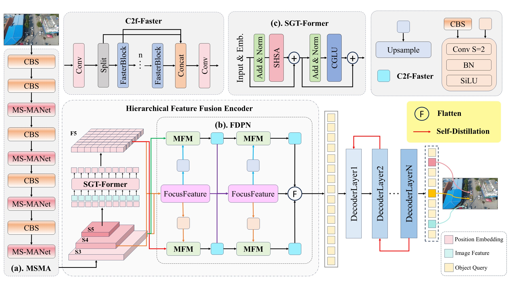

# ITNet: Inductive Transformer Network with Diffusion of Feature for UAV Small Object Detection

<div align="center">

**中文** | [English](./README_en.md)

[](https://www.springer.com/371)
[](LICENSE)
[](https://pytorch.org/)

**[Fei Han](https://cs.ujs.edu.cn/info/1508/27347.htm)*, [Jun Yang](https://github.com/NGIWS830), Wen Gu, Henry Han, Conghua Zhou**

*School of Computer Science and Communication Engineering, Jiangsu University*

</div>

---

## 📖 简介 (Introduction)

**ITNet** 是一个专为 **无人机 (UAV) 航拍图像小目标检测** 设计的高效深度学习网络。针对航拍场景中存在的“各向异性目标畸变”和下采样过程中的“信息坍塌”问题，本项目提出了一种基于特征扩散和归纳偏置的 Transformer 架构。

在 **VisDrone2019** 和 **HIT-UAV** 数据集上，ITNet 相比 DEIM 基线模型，在保持实时推理速度的同时，显著提升了小目标的检测精度 ($AP_S$ 分别提升 **5.0%** 和 **3.3%**)。

<div align="center">
  
  <br>
  <em>图 1: ITNet 整体架构图 (MSMA Backbone + FDPN + SGT-Former)</em>
</div>

## 🚀 Performance

We compare ITNet with state-of-the-art real-time object detectors on the VisDrone dataset. As shown below, **ITNet achieves the best trade-off** between accuracy ($AP_S$), speed (FLOPs), and model size (Params).

<div align="center">
  
  <br>
  <em><b>Figure:</b> Comprehensive performance comparison. ITNet (Red) is located in the top-left region, indicating superior performance with lower computational cost.</em>
</div>

## 🚀 核心创新 (Key Features)

基于论文的核心贡献，本项目实现了以下模块：

* **MSMA Backbone (正交分解骨干网):**
    * 引入正交分解范式 (Orthogonal Decomposition Paradigm)，通过垂直和水平梯度流解决航拍目标的几何畸变问题。
    * 集成 **InceptionDWBlock** 以增强多尺度特征提取。
* **FDPN (聚焦-扩散金字塔网络):**
    * 通过 **FocusFeature** 模块建立特征扩散机制，主动传播核心语义信号。
    * 对抗下采样过程中的“信息坍塌”，有效重建微小目标的特征流。
* **SGT-Former (归纳偏置驱动编码器):**
    * 结合 **单头自注意力 (SHSA)** 与局部门控机制 (Local Gating)。
    * 引入硬件友好的归纳偏置，在降低计算冗余的同时优化全局建模能力。

## 📊 性能表现 (Model Zoo)

| Model | Params (M) | FLOPs (G) | VisDrone $AP$ | VisDrone $AP_{50}$ | VisDrone $AP_{75}$ | VisDrone $AP_S$ | HIT-UAV $AP$ | HIT-UAV $AP_{50}$ | HIT-UAV $AP_{75}$ | HIT-UAV $AP_S$ |
| :---: | :---: | :---: | :---: | :---: | :---: | :---: | :---: | :---: | :---: | :---: |
| **ITNet** | **9.4** (↓8.2%) | **24.3** (↓2.3%) | **26.7** (↑3.6%) | **44.2** (↑5.3%) | **27.1** (↑3.7%) | **19.1** (↑5.0%) | **54.1** (↑1.9%) | **82.7** (↑3.8%) | **57.9** (↑0.7%) | **40.6** (↑3.3%) |

> **注:** 更多详细实验结果请参考论文。

## 🛠️ 环境准备 (Installation)

建议使用 Python 3.8+ 和 PyTorch 2.3.0+。

```bash
# 1. 克隆仓库
git clone https://github.com/NGIWS830/ITNet.git
cd ITNet

# 2. 安装依赖
pip install -r requirements.txt
```

(注意：如果根目录没有 `requirements.txt`，请参考 `tools/benchmark/requirements.txt` 或手动安装 `torch`, `torchvision`, `pyyaml`, `tqdm`, `opencv-python`, `scipy` 等基础库)

## 📂 数据准备 (Data Preparation)

本项目支持 **COCO 格式** 的数据集。如果您使用的是 VisDrone2019 或 HIT-UAV 等无人机数据集，请确保已将其转换为标准的 COCO JSON 标注格式。

数据集目录结构建议如下：

```text
dataset/
  ├── annotations/
  │   ├── instances_train2017.json
  │   └── instances_val2017.json
  ├── train2017/
  └── val2017/
  ```
在配置文件（如 configs/dataset/visdrone_detection.yml）中修改路径以匹配您的数据位置。

## 🚅 训练 (Training)
使用 train.py 脚本开始训练。您可以通过 -c 指定配置文件。

单卡训练示例：

```bash
python train.py \
    -c configs/cfg-improve/ITNet.yaml \
    --use-amp \
    --seed 42 \
    --output-dir ./output/ITNet_exp
```
多卡分布式训练示例：

```bash
python -m torch.distributed.launch --nproc_per_node=4 train.py \
    -c configs/cfg-improve/ITNet.yaml \
    --use-amp \
    --output-dir ./output/ITNet_exp
```
主要参数说明：

-c, --config: 配置文件路径 (e.g., configs/cfg-improve/ITNet.yaml)

-r, --resume: 从检查点恢复训练 (e.g., output/checkpoint.pth)

--use-amp: 启用自动混合精度训练 (推荐)

--tuning: 加载预训练权重进行微调

## ⚡ 推理与可视化 (Inference)
使用 tools/inference/torch_inf.py 对图片或视频进行检测推理。

命令示例：

```bash
python tools/inference/torch_inf.py \
    -c configs/cfg-improve/ITNet.yaml \
    -r output/ITNet_exp/best.pth \
    -i ./path/to/image_or_video \
    -o ./inference_results \
    -t 0.4 \
    -d 0
```
参数说明：

-i, --input: 输入图片路径、视频路径或文件夹路径

-r, --resume: 训练好的模型权重文件 (.pth)

-t, --thrh: 置信度阈值 (默认: 0.2)

-d, --device: 推理设备 (如 0 表示 cuda:0, cpu 表示使用 CPU)

## 📁 项目结构 (Project Structure)
```bash
ITNet/
├── configs/             # 配置文件 (模型架构, 数据集, 优化器等)
│   ├── cfg-improve/     # ITNet 核心架构配置
│   └── ...
├── engine/              # 核心引擎 (Trainer, Solver, Backbone, Modules)
├── tools/               # 工具脚本
│   ├── inference/       # 推理脚本 (torch_inf.py)
│   ├── deployment/      # ONNX/TensorRT 导出工具
│   └── visualization/   # 可视化工具
├── train.py             # 训练入口脚本
└── requirements.txt     # 依赖列表
```

## 📜 引用 (Citation)
如果您在研究中使用了本项目，请引用：

```bash
@article{ITNet2026,
  title={ITNet: Improved Transformer Network for Enhanced Small Object Detection in UAV Imagery},
  author={Fei Han},
  journal={Journal Name},
  year={2026}
}
```

## 🙏 致谢 (Acknowledgements)
本项目基于优秀的开源项目 [DEIM](https://github.com/Intellindust-AI-Lab/DEIM) 构建，感谢原作者的贡献。

