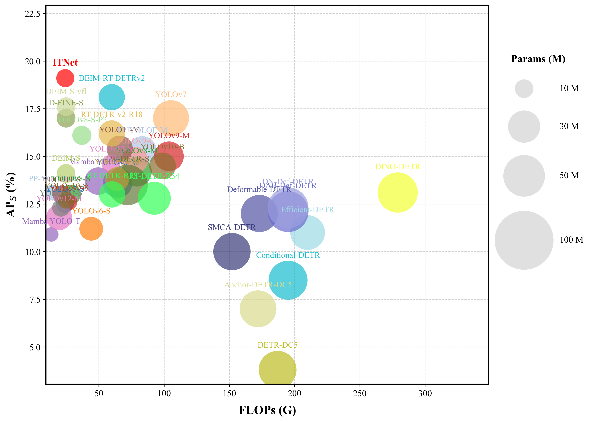

# ITNet: Inductive Transformer Network with Diffusion of Feature for UAV Small Object Detection

<div align="center">

**English** | [中文](./README.md)

[](https://www.springer.com/371)
[](LICENSE)
[](https://pytorch.org/)

**[Fei Han](https://cs.ujs.edu.cn/info/1508/27347.htm)*, [Jun Yang](https://github.com/NGIWS830), Wen Gu, Henry Han, Conghua Zhou**

*School of Computer Science and Communication Engineering, Jiangsu University*

</div>

---

## 📖 Introduction

**ITNet** is a high-efficiency deep learning network designed specifically for **small object detection in UAV aerial imagery**. Addressing the challenges of "anisotropic object distortion" and "information collapse" during downsampling in aerial scenarios, this project proposes a Transformer architecture based on feature diffusion and inductive bias.

On the **VisDrone2019** and **HIT-UAV** datasets, compared to the DEIM baselines, ITNet significantly improves small object detection accuracy ($AP_S$ increased by **5.0%** and **3.3%**, respectively) while maintaining real-time inference speed.

<div align="center">
  
  <br>
  <em>Figure 1: Overall Architecture of ITNet (MSMA Backbone + FDPN + SGT-Former)</em>
</div>

## 🚀 Performance

We compare ITNet with state-of-the-art real-time object detectors on the VisDrone dataset. As shown below, **ITNet achieves the best trade-off** between accuracy ($AP_S$), speed (FLOPs), and model size (Params).

<div align="center">
  
  <br>
  <em><b>Figure:</b> Comprehensive performance comparison. ITNet (Red) is located in the top-left region, indicating superior performance with lower computational cost.</em>
</div>

## 🚀 Key Features

Based on the core contributions of the paper, this project implements the following modules:

* **MSMA Backbone (Orthogonal Decomposition Backbone):**
    * Introduces an **Orthogonal Decomposition Paradigm**, addressing geometric distortion of aerial objects via vertical and horizontal gradient flows.
    * Integrates **InceptionDWBlock** to enhance multi-scale feature extraction.
* **FDPN (Focus-Diffusion Pyramid Network):**
    * Establishes a feature diffusion mechanism via the **FocusFeature** module to actively propagate core semantic signals.
    * Counteracts "information collapse" during downsampling, effectively reconstructing feature flows for minute objects.
* **SGT-Former (Inductive Bias-driven Encoder):**
    * Synergizes **Single-Head Self-Attention (SHSA)** with a Local Gating mechanism.
    * Introduces hardware-friendly inductive biases, optimizing global modeling while reducing computational redundancy.

## 📊 Model Zoo

| Model | Params (M) | FLOPs (G) | VisDrone $AP$ | VisDrone $AP_{50}$ | VisDrone $AP_{75}$ | VisDrone $AP_S$ | HIT-UAV $AP$ | HIT-UAV $AP_{50}$ | HIT-UAV $AP_{75}$ | HIT-UAV $AP_S$ |
| :---: | :---: | :---: | :---: | :---: | :---: | :---: | :---: | :---: | :---: | :---: |
| **ITNet** | **9.4** (↓8.2%) | **24.3** (↓2.3%) | **26.7** (↑3.6%) | **44.2** (↑5.3%) | **27.1** (↑3.7%) | **19.1** (↑5.0%) | **54.1** (↑1.9%) | **82.7** (↑3.8%) | **57.9** (↑0.7%) | **40.6** (↑3.3%) |

> **Note:** For more detailed experimental results, please refer to the paper.

## 🛠️ Installation

Python 3.8+ and PyTorch 2.3.0+ are recommended.

```bash
# 1. Clone repository
git clone [https://github.com/NGIWS830/ITNet.git](https://github.com/NGIWS830/ITNet.git)
cd ITNet

# 2. Install dependencies
pip install -r requirements.txt
```

(Note: If requirements.txt is missing in the root directory, please refer to tools/benchmark/requirements.txt or manually install basic libraries such as torch, torchvision, pyyaml, tqdm, opencv-python, scipy, etc.)

## 📂 Data Preparation

This project supports datasets in **COCO format**. If you are using drone datasets such as VisDrone2019 or HIT-UAV, please ensure they are converted to the standard COCO JSON annotation format.

The recommended dataset directory structure is as follows:

```text
dataset/
  ├── annotations/
  │   ├── instances_train2017.json
  │   └── instances_val2017.json
  ├── train2017/
  └── val2017/
  ```
Modify the path in the configuration file (e.g., `configs/dataset/visdrone_detection.yml`) to match your local data location.

## 🚅 Training
Use the `train.py` script to start training. You can specify the configuration file via `-c`.

Single-GPU training example:

```bash
python train.py \
    -c configs/cfg-improve/ITNet.yaml \
    --use-amp \
    --seed 42 \
    --output-dir ./output/ITNet_exp
```
Multi-GPU distributed training example:

```bash
python -m torch.distributed.launch --nproc_per_node=4 train.py \
    -c configs/cfg-improve/ITNet.yaml \
    --use-amp \
    --output-dir ./output/ITNet_exp
```
**Main Arguments:**

* `-c, --config`: Path to the configuration file (e.g., `configs/cfg-improve/ITNet.yaml`).
* `-r, --resume`: Resume training from a checkpoint (e.g., `output/checkpoint.pth`).
* `--use-amp`: Enable Automatic Mixed Precision (AMP) training (recommended).
* `--tuning`: Load pre-trained weights for fine-tuning.

## ⚡ Inference
Use `tools/inference/torch_inf.py` to run inference on images or videos.

**Command Example:**

```bash
python tools/inference/torch_inf.py \
    -c configs/cfg-improve/ITNet.yaml \
    -r output/ITNet_exp/best.pth \
    -i ./path/to/image_or_video \
    -o ./inference_results \
    -t 0.4 \
    -d 0
```
**Arguments:**

* `-i, --input`: Input path (image file, video file, or folder path).
* `-r, --resume`: Path to the trained model weights file (.pth).
* `-t, --thrh`: Confidence threshold (default: 0.2).
* `-d, --device`: Inference device (e.g., `0` for cuda:0, `cpu` for CPU).

## 📁 Project Structure
```bash
ITNet/
├── configs/             # Configuration files (Model architecture, dataset, optimizer, etc.)
│   ├── cfg-improve/     # Core ITNet architecture configurations
│   └── ...
├── engine/              # Core engine (Trainer, Solver, Backbone, Modules)
├── tools/               # Utility scripts
│   ├── inference/       # Inference scripts (torch_inf.py)
│   ├── deployment/      # ONNX/TensorRT export tools
│   └── visualization/   # Visualization tools
├── train.py             # Training entry point
└── requirements.txt     # List of dependencies
```

## 📜 Citation
If you use this project in your research, please cite:

```bash
@article{ITNet2026,
  title={ITNet: Improved Transformer Network for Enhanced Small Object Detection in UAV Imagery},
  author={Fei Han},
  journal={Journal Name},
  year={2026}
}
```

## 🙏 Acknowledgements
This project is built upon the excellent open-source projects [DEIM](https://github.com/Intellindust-AI-Lab/DEIM). We thank the original authors for their contributions.
